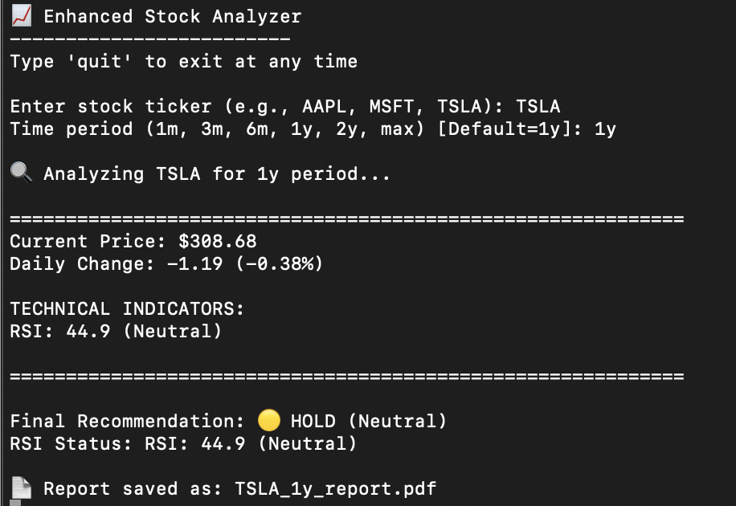
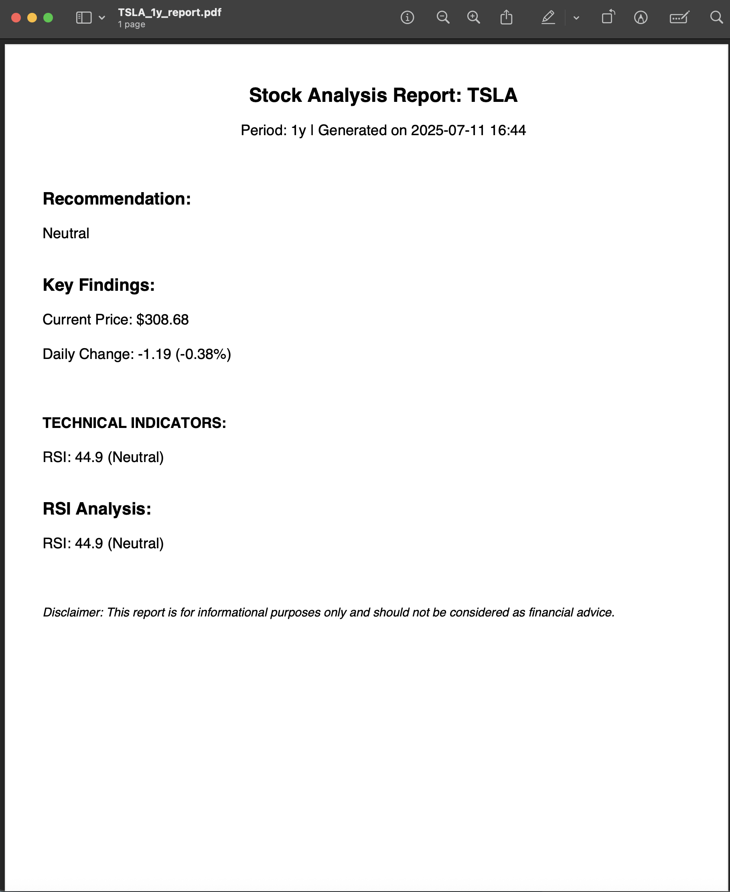

# 📈 NoirSVortex - Stock Market Analyzer
*A Python-based stock analysis tool that fetches market data, performs technical analysis, and generates reports with visualizations.*





## ✨ Features

**📊 Advanced Charting**
- Interactive price charts with 50-day/200-day moving averages
- RSI visualization with overbought/oversold indicators
- Matplotlib-powered dual-pane technical analysis

**📈 Smart Analysis Engine**
- Automatic RSI (Relative Strength Index) calculations
- Daily price change metrics with percentage tracking
- BUY/SELL/HOLD recommendations based on momentum

**📄 Professional Reporting**
- PDF report generation with key findings (requires fpdf)
- Clean Latin-1 compatible text formatting
- Timestamped analysis with disclaimer

**🌐 Data Integration**
- Real-time Yahoo Finance data fetching
- Flexible time periods (1m, 3m, 6m, 1y, 2y, max)
- Error handling for invalid tickers

## 🛠 Tech Stack
[!Python](https://img.shields.io/badge/Python-3.6+-white?logo=python) [!yfinance](https://img.shields.io/badge/yfinance-Data_API-black) [!Matplotlib](https://img.shields.io/badge/Matplotlib-Visualization-lightgrey)

```
import yfinance as yf
import matplotlib.pyplot as plt
import matplotlib.dates as mdates
from datetime import datetime, timedelta
import textwrap
import requests
from bs4 import BeautifulSoup
import pandas as pd
import os

# Try to import PDF library (optional feature)
try:
    from fpdf import FPDF
    PDF_SUPPORT = True
except ImportError:
    PDF_SUPPORT = False
    print("\nNote: PDF reports disabled (install 'fpdf' for full features)")

# ==================== CORE FUNCTIONS ==================== #
def get_stock_data(ticker, period):
    """Fetch stock data from Yahoo Finance"""
    try:
        stock = yf.Ticker(ticker)
        data = stock.history(period=period)
        return data
    except Exception as e:
        print(f"Error fetching data: {str(e)}")
        return None

def clean_text_for_pdf(text):
    """Remove emojis and non-Latin-1 characters for PDF compatibility"""
    return text.encode('latin-1', 'ignore').decode('latin-1')

def generate_report(ticker, period, analysis, rsi_status, recommendation):
    """Generate PDF report with Unicode handling"""
    try:
        if not PDF_SUPPORT:
            return None
            
        filename = f"{ticker}_{period}_report.pdf"
        pdf = FPDF()
        pdf.add_page()
        pdf.set_font("Arial", size=12)
        
        # Header
        pdf.set_font("Arial", 'B', 16)
        pdf.cell(200, 10, txt=clean_text_for_pdf(f"Stock Analysis Report: {ticker}"), ln=1, align='C')
        pdf.set_font("Arial", size=12)
        pdf.cell(200, 10, txt=clean_text_for_pdf(f"Period: {period} | Generated on {datetime.now().strftime('%Y-%m-%d %H:%M')}"), ln=1, align='C')
        pdf.ln(10)
        
        # Recommendation (without emoji)
        clean_rec = recommendation.split(' ')[-1].strip('()')
        pdf.set_font("Arial", 'B', 14)
        pdf.cell(200, 10, txt="Recommendation:", ln=1)
        pdf.set_font("Arial", size=12)
        pdf.multi_cell(0, 10, txt=clean_text_for_pdf(clean_rec))
        pdf.ln(5)
        
        # Key Metrics
        pdf.set_font("Arial", 'B', 14)
        pdf.cell(200, 10, txt="Key Findings:", ln=1)
        pdf.set_font("Arial", size=12)
        
        for line in analysis.split('\n'):
            clean_line = clean_text_for_pdf(line)
            if any(section in line for section in ["TECHNICAL INDICATORS:", "RECENT NEWS"]):
                pdf.set_font("Arial", 'B', 12)
                pdf.cell(0, 10, txt=clean_line, ln=1)
                pdf.set_font("Arial", size=12)
            else:
                pdf.cell(0, 10, txt=clean_line, ln=1)
        
        # RSI Status
        pdf.ln(5)
        pdf.set_font("Arial", 'B', 14)
        pdf.cell(200, 10, txt="RSI Analysis:", ln=1)
        pdf.set_font("Arial", size=12)
        pdf.multi_cell(0, 10, txt=clean_text_for_pdf(rsi_status))
        
        # Disclaimer
        pdf.ln(10)
        pdf.set_font("Arial", 'I', 10)
        pdf.multi_cell(0, 10, txt="Disclaimer: This report is for informational purposes only and should not be considered as financial advice.")
        
        pdf.output(filename)
        return filename
    except Exception as e:
        print(f"⚠️ Could not generate PDF: {str(e)}")
        return None

def analyze_stock(ticker, period):
    """Main analysis function"""
    print(f"\n🔍 Analyzing {ticker} for {period} period...")
    
    data = get_stock_data(ticker, period)
    if data is None or data.empty:
        print(f"⚠️ No data found for {ticker}. Please check the ticker symbol.")
        return None
    
    # Basic price info
    current_price = data['Close'].iloc[-1]
    prev_close = data['Close'].iloc[-2] if len(data) > 1 else current_price
    price_change = current_price - prev_close
    pct_change = (price_change / prev_close) * 100
    
    # Generate analysis
    analysis_lines = [
        f"Current Price: ${current_price:.2f}",
        f"Daily Change: {'+' if price_change >= 0 else ''}{price_change:.2f} ({'+' if pct_change >= 0 else ''}{pct_change:.2f}%)"
    ]
    
    # Simple recommendation logic (with emojis for console)
    if pct_change > 1.5:
        recommendation = "🟢 BUY (Positive Momentum)"
    elif pct_change < -1.5:
        recommendation = "🔴 SELL (Negative Momentum)"
    else:
        recommendation = "🟡 HOLD (Neutral)"
    
    # RSI calculation
    delta = data['Close'].diff()
    gain = delta.clip(lower=0)
    loss = -delta.clip(upper=0)
    avg_gain = gain.rolling(14).mean()
    avg_loss = loss.rolling(14).mean()
    rs = avg_gain / avg_loss
    rsi = 100 - (100 / (1 + rs))
    last_rsi = rsi.iloc[-1]
    
    if last_rsi > 70:
        rsi_status = f"RSI: {last_rsi:.1f} (Overbought - Potential pullback expected)"
    elif last_rsi < 30:
        rsi_status = f"RSI: {last_rsi:.1f} (Oversold - Potential rebound expected)"
    else:
        rsi_status = f"RSI: {last_rsi:.1f} (Neutral)"
    
    analysis_lines.append(f"\nTECHNICAL INDICATORS:")
    analysis_lines.append(rsi_status)
    
    analysis = "\n".join(analysis_lines)
    
    # Generate report
    report_filename = generate_report(ticker, period, analysis, rsi_status, recommendation)
    
    return {
        'data': data,
        'analysis': analysis,
        'recommendation': recommendation,
        'rsi_status': rsi_status,
        'report_filename': report_filename
    }

def plot_stock_data(data, ticker):
    """Plot price and RSI charts"""
    plt.figure(figsize=(14, 10))
    
    # Price Chart
    plt.subplot(2, 1, 1)
    plt.plot(data.index, data['Close'], label='Price', color='dodgerblue', linewidth=2)
    
    if len(data) >= 50:
        plt.plot(data.index, data['Close'].rolling(50).mean(), label='50-day MA', color='orange')
    if len(data) >= 200:
        plt.plot(data.index, data['Close'].rolling(200).mean(), label='200-day MA', color='red')
    
    plt.title(f'{ticker} Stock Price', fontweight='bold')
    plt.legend()
    plt.grid(True, alpha=0.3)
    
    # RSI Chart
    plt.subplot(2, 1, 2)
    delta = data['Close'].diff()
    gain = delta.clip(lower=0)
    loss = -delta.clip(upper=0)
    avg_gain = gain.rolling(14).mean()
    avg_loss = loss.rolling(14).mean()
    rsi = 100 - (100 / (1 + (avg_gain / avg_loss)))
    plt.plot(data.index, rsi, color='purple')
    plt.axhline(70, color='red', linestyle='--', alpha=0.5, label='Overbought (70)')
    plt.axhline(30, color='green', linestyle='--', alpha=0.5, label='Oversold (30)')
    plt.title('Relative Strength Index (14-day)')
    plt.legend()
    plt.grid(True, alpha=0.3)
    
    plt.tight_layout()
    plt.show()

def main():
    print("\n📈 Enhanced Stock Analyzer")
    print("-------------------------")
    print("Type 'quit' to exit at any time\n")
    
    while True:
        ticker = input("Enter stock ticker (e.g., AAPL, MSFT, TSLA): ").strip().upper()
        if ticker.lower() == 'quit':
            break
        
        period = input("Time period (1m, 3m, 6m, 1y, 2y, max) [Default=1y]: ").strip() or '1y'
        if period.lower() == 'quit':
            break
        
        result = analyze_stock(ticker, period)
        if result is None:
            continue
        
        print("\n" + "="*60)
        print(result['analysis'])
        print("\n" + "="*60)
        print(f"\nFinal Recommendation: {result['recommendation']}")
        print(f"RSI Status: {result['rsi_status']}")
        
        if result['report_filename']:
            print(f"\n📄 Report saved as: {result['report_filename']}")
        else:
            print("\nℹ️ Text report only (install 'fpdf' for PDF reports)")
        
        plot_stock_data(result['data'], ticker)
        
        another = input("\nAnalyze another stock? (y/n): ").strip().lower()
        if another != 'y':
            break
    
    print("\nThank you for using the Stock Analyzer. Goodbye!")

if __name__ == "__main__":
    main()
```
## 📊 Key Components

**DataFetcher:** Yahoo Finance API wrapper with error handling

**RSICalculator:** 14-day Relative Strength Index Analyzer

**PDFGenerator:** Custom report builder with section formatting

**Plotter:** Dual-chart visualization system

## 💡 How to Use

1. **Run** the interzctive analyzer: ```python3 noirsvortex.py```
2. **Enter** a stock ticker (e.g., AAPL, TSLA)
3. **Select** time period (default: 1 year)
4. **View** analysis and charts
5. **Save** PDF report (only possible with fpdf installed)

## 🚀 Quick Start
```
# Clone and install
git clone https://github.com/yourusername/noirsvortex.git
cd noirsvortex
pip install -r requirements.txt

# Run analyzer
python noirsvortex.py
```

## ⚙️ Requirements
- Python 3.6+
- Core Dependencies:
yfinance matplotlib pandas requests beautifulsoup4
- Optional for PDFs: ```fpdf```

## 🤝 Contributing

PRs welcome! Potential enhancements:

- Add MACD/Stochastic indicators
- News sentiment analysis integration
- Portfolio tracking features
- Interactive HTML reports

*Disclaimer: For educational purposes only. Not financial advice.*
